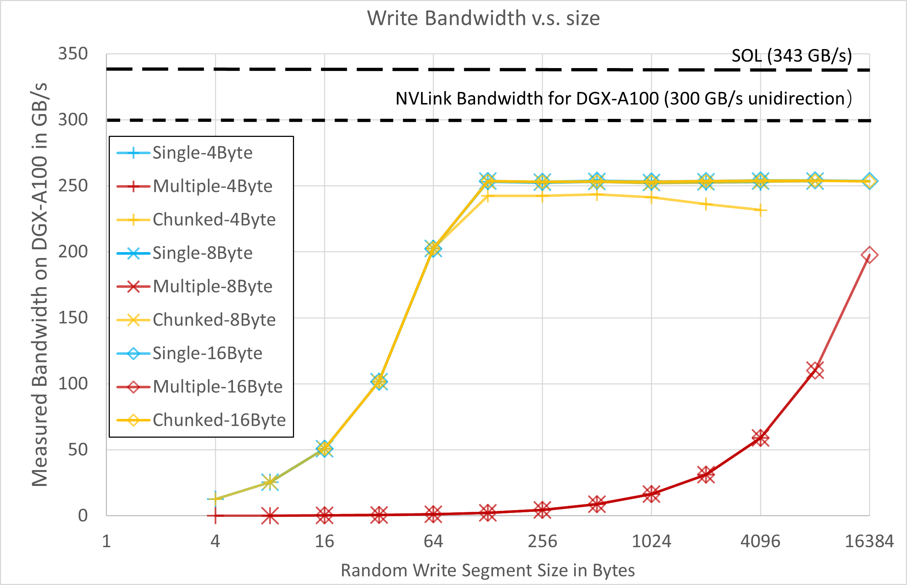
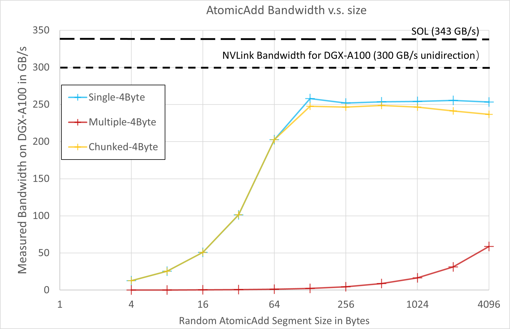

# WholeMemory Performance Benchmark

## Benchmark Environment

### Hardware

[DGX-A100 640G](https://www.nvidia.com/en-us/data-center/dgx-a100/)

### Software

Nvidia driver 470.82  
CUDA 11.4

## Benchmark Setup

In order to benchmark the memory bandwidth WholeMemory can provide when the memory footprint is large, we set the memory footprint to 400 GB.
Then we use a GPU kernel to random read may segment of data from the large memory, and write to local device memory.
All the 8 GPU do this read in a concurrent manner.
The segment size varies from 4 bytes to 16K bytes and are naturally aligned.
As more than one thread may be needed to read the segment, we benchmarked three cases: 4 bytes per thread, 8 bytes per thread and 16 bytes per thread.
All the three modes available for device memory are benchmarked, they are single process mode, multi-process mode, and multi-process mode using chunked API.
And read, write and atomicAdd performance are tested, for atomicAdd, only 4 byte per thread is tested as vector atomicAdd for float is not support by CUDA.

## Benchmark Source Code

The source code for the benchmark is available at `test/whole_memory_perf_scan.cu`

## Benchmark Result

The benchmark result is shown below:

### Random Read Perfomrance 

As we can see, for single process mode and multi-process mode using chunked API, as long as the segment size is 64 bytes, more than 200 GB/s bandwidth can be achieved.
And if the segment size is 128 bytes or more, about 260 GB/s bandwidth can be achieved.
For data size per thread, there is a little performance degradation for 4 bytes, 8 bytes and 16 bytes almost have the same performance.

As we know, the NVLink bandwidth for each GPU on DGX-A100 is 300 GB/s unidirection, and for 8 GPU case, about 7 eighth of data has to go from NVLink, assume local device bandwidth is large enough, the Speed of Light (SOL) is 343 GB/s.
That means 76% of NVLink's bandwidth can be achieved with 128 bytes small segments.

As this bandwid is per GPU, for the whole system, the aggregated bandwidth of the WholeMemory (hundreds of GBs) is about 2.1 TB/s.

That means WholeMemory can provide hundreds of GBs of direct accessible memory capacity with random read access bandwidth of up to 2.1 TB/s!

### Random Write Performance

Similar performance curve to random read, byt a slightly decrease in peak performance, at about 253 GB/s.

### Random AtomicAdd Performance

Very similar to random write.

